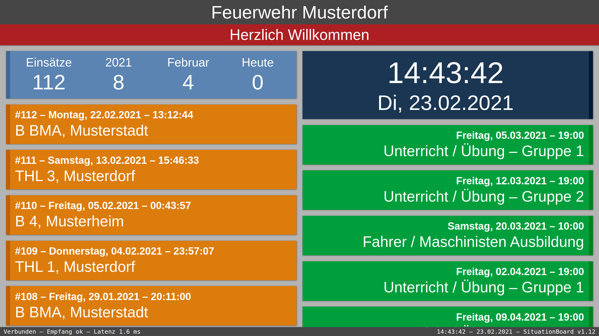
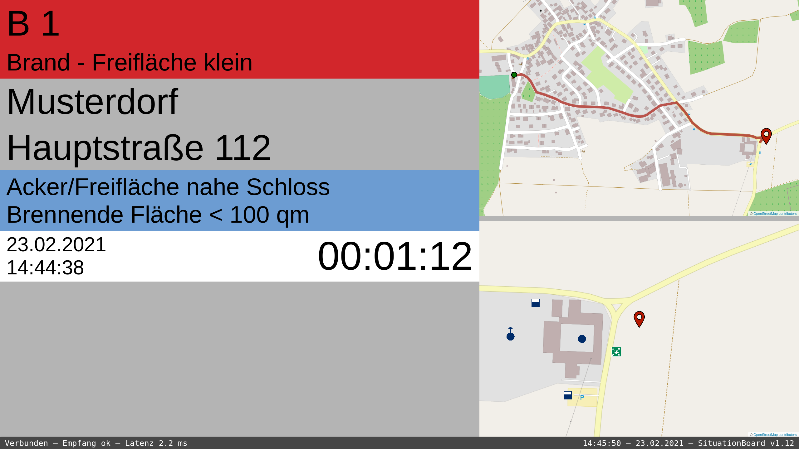
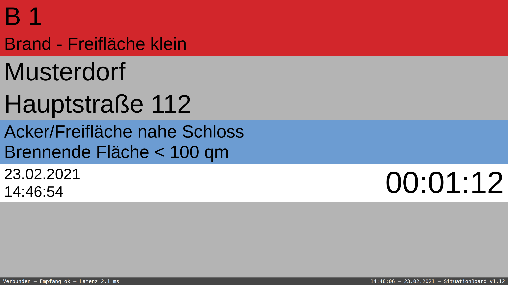
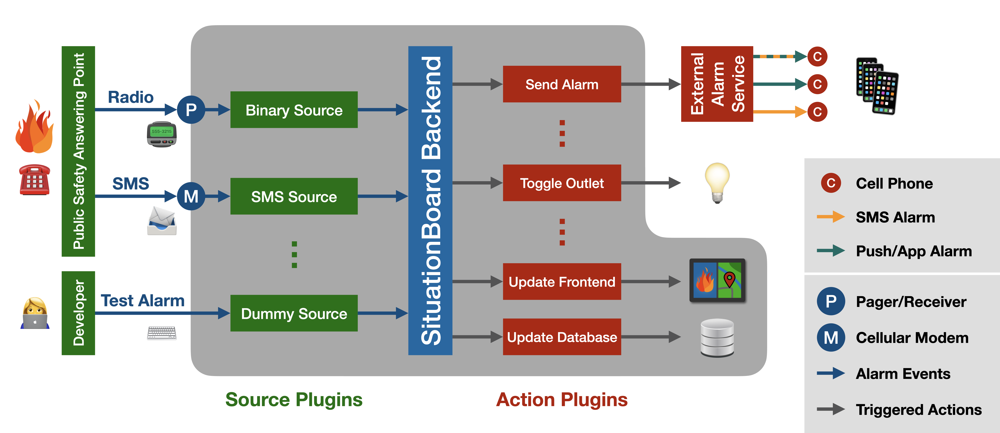

# SituationBoard
Alarm Display for Fire Departments

## Description

SituationBoard is a web-based application that provides an alarm and information display for fire departments and emergency services.
It consists of a Python backend (that is extendable via plugins) and an HTML/JavaScript frontend.
SituationBoard offers a lot of configuration options and supports different alarm sources.
In addition, an alarm can trigger several actions (e.g. sending alarm messages via an external service or controlling outlets / alarm lights).

**Keywords:**
Alarm, Emergency, Operation, Fire, Rescue, Mission, Situation, Incident, Briefing,
Display, Monitor, Screen, Dashboard, Board, View, Panel, Visualization,
Einsatz, Lage, Feuerwehr, FW, FFW, THW, Technisches Hilfswerk, Rettungsdienst, Alarmierung, Visualisierung, Anzeige, Bildschirm,
Alarmmonitor, Einsatzmonitor, Alarmanzeige, Einsatzanzeige, Alarmdisplay, Einsatzdisplay, Divera 24/7

### Features


- supports multiple sources (e.g. SMS, binary sources, and web APIs)
- alarm view with optional support for maps (showing route and fire hydrants at location)
- enables forwarding of alarms to external alarm services
- can trigger a variety of other alarm actions (e.g. turn on lights)
- stores alarms in a database with CSV import/export support
- standby view with recent alarms, statistics and upcoming calendar events
- support for an arbitrary number of screens/monitors
- extensive configuration options for frontend and backend
- robust handling of alarms (fallback to raw mode if messages cannot be parsed)
- extendable via plugins (alarm sources/parsers, alarm actions)
- setup script, systemd service and extensive documentation

### Screenshots


**Standby View** (showing recent alarms, statistics and upcoming calendar events)


**Alarm View with Maps** (showing nearby fire hydrants, water tanks etc.)


**Simplified Alarm View** (for improved readability)

### System Overview


**Overview of SituationBoard** (with a selection of source and action plugins)

## License and Credits

This project is licensed unter the terms of the GNU Affero General Public License, version 3 (AGPLv3).
See [LICENSE](LICENSE) file for more details.

The credits in form of a list of contributors and used third-party projects can be found in [CREDITS.md](CREDITS.md).


## Hardware Requirements
- [Raspberry Pi](https://www.raspberrypi.org) or another Linux box
- Huawei E303 UMTS-Modem (optional, required only for alarm reception via SMS)
- HDMI TV/Display (with optional [CEC](https://en.wikipedia.org/wiki/Consumer_Electronics_Control) support)
- Internet access (optional for calendar updates, maps and external alarm services)

## Software Requirements
- [Linux](https://de.wikipedia.org/wiki/Linux) (with [systemd](https://en.wikipedia.org/wiki/Systemd) and GUI)
- [Gammu](https://wammu.eu/gammu/) (SMS/Phone Library, optional)
- [Python](https://https://en.wikipedia.org/wiki/Python_(programming_language)) (Version >= 3.7)
  - [Flask](https://en.wikipedia.org/wiki/Flask_(web_framework)) (Webserver)
  - [Flask-SocketIO](https://flask-socketio.readthedocs.io/en/latest/) (Socket IO for Webserver)
- some other Python, JavaScript and Linux packages

## Installation
To install SituationBoard, checkout this GIT repository to the target machine and use the ```install``` command of the ```sbctl``` tool:
```
# Clone GIT with SSH key:
git clone git@github.com:SituationBoard/SituationBoard.git

# Clone GIT without SSH key:
git clone https://github.com/SituationBoard/SituationBoard.git

# Install SituationBoard:
cd SituationBoard
sudo ./sbctl install
```
The automatic setup should work on Debian-based Linux distros (like [Raspbian/Raspberry Pi OS](https://www.raspbian.org) or [Ubuntu](https://www.ubuntu.com)).
It first asks some questions on required features and then installs all the required dependencies.
It also makes several adjustments to the system depending on the selected features (e.g. enables autostart of the browser, disables screensaver, ...).
After the installation, it is necessary to adjust the [configuration](docs/Configuration.md) in the ```situationboard.conf``` file before the first start.

In addition to the setup script, there is also a [guide](docs/ManualInstallation.md) on how to install SituationBoard manually.

Depending on your needs it might also be useful to enable the SSH daemon
for remote command line access and the automatic GUI login on startup.
On Raspbian both these settings can be configured with the command ```sudo raspi-config```.

## Getting started
To interact with the backend server the ```sbctl``` command line tool is used.
It allows debugging, importing/exporting data and controlling the systemd service.
For a full list of available commands run the ```sbctl``` command line tool (without any parameter).

### Starting the server (for testing/debugging)
Before running the server for the first time, make sure you adjusted the configuration in the ```situationboard.conf``` file according to your needs.
An extensive documentation on the configuration options is available [here](docs/Configuration.md).

Afterwards, test your setup by executing:
```
sbctl run
```
The server should now be running in the background and the website of the frontend should be available under:
```http://localhost:5000```

All console output of the backend server is also written to ```situationboard.log```.

To kill the server use the command ```sbctl kill```.

### Sending test alarms
By default, SituationBoard is configured for testing/development purposes and therefore uses the ```dummy``` driver as source for events.
This allows you to send test alarms to the running server with one of the following two commands.

To simulate regular (text) alarms use:
```
sbctl dalarm
```

To simulate binary alarms use:
```
sbctl dbinary
```

### Exporting alarms to CSV
To export all alarms from the database and store them into a [CSV](https://en.wikipedia.org/wiki/Comma-separated_values)
file use the following command:
```
sbctl export <csv-file>
```
This export functionality is handy for example to backup alarm events in a human-readable format,
to allow processing of alarm events with external tools, or to analyze received alarm events manually.

More details on alarm events, their information and the CSV format can be found in [docs/CSV.md](docs/CSV.md).

### Importing alarms from CSV
To import alarms from a CSV file and add them to an existing database use the following command:
```
sbctl import <csv-file>
```
This import functionality is handy for example to restore CSV backups or to add/edit alarm events manually.

To also reset the database before importing the alarms from the CSV file use the following command instead:
```
sbctl rimport <csv-file>
```

### Permanently enabling the service (for production use)
After adjusting the configuration and extensive testing, the following commands can be used to permanently enable the service:
```
sbctl enable
sbctl start
```

### Updating SituationBoard
To update the local installation with a ```git pull``` of the newest version use the command:
```
sbctl update
```
After an update it might be necessary to adjust your ```situationboard.conf``` configuration file
(see [CHANGELOG.md](CHANGELOG.md) and [docs/Configuration.md](docs/Configuration.md) for details).

### Backing up configuration and data (to a remote machine)
To backup the configuration, the database and a CSV to a remote machine use:
```
sbctl backup <HOST>:<PATH>
```

### Update standby view (via SMS)
If you use the ```SMS``` source driver, the information on the standby view can be updated via SMS.
To update the header or news line you can simply write an SMS in the format
```
header=<HEADER_TEXT>
```
or
```
news=<NEWS_TEXT>
```
If there is no text specified for header/news the corresponding lines will be hidden from the standby view.

## Custom Plugins
SituationBoard comes with a variety of source drivers, message parsers and action handlers.
However, you can always add additional sources, parsers and actions in form of plugins (and share them with others).

**Pull requests (e.g. with new plugins or other improvements) are always welcome.**

### Write your own source driver or message parser
Depending on the alarm source (SMS, Binary, Dummy, ...) and the format of the alarm messages it might be necessary to create your own source driver or parser.
When writing your own driver or parser, you can use an existing source driver or parser as a template and adjust it according to your needs.

### Write your own action plugin
An alarm can already trigger a variety of actions (e.g. it can be forwarded to external services or activate external devices).
However, if you need to trigger different actions feel free to add a new action plugin.
Most of the time, the integration of additional actions in form of a new plugin is only a matter of minutes.

### Getting started
The plugins are subclasses of [SourceDriver](backend/source/SourceDriver.py),
[MessageParser](backend/source/MessageParser.py) or
[Action](backend/action/Action.py).
An extensive documentation of the different plugin types (and an overview of the interfaces those plugins implement)
can be found in the aforementioned files.

**Important:**
To use new plugins they also have to be added to the [PluginManager](backend/util/PluginManager.py).
